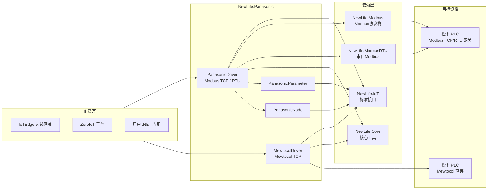
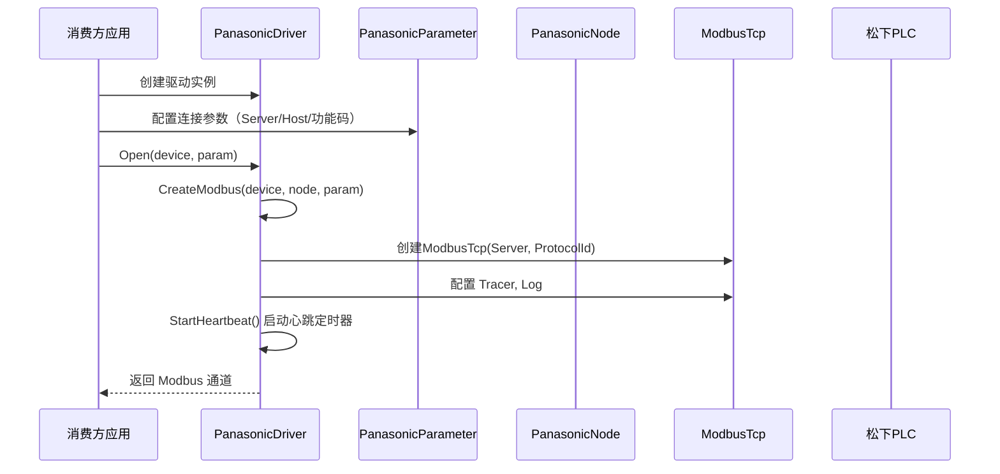
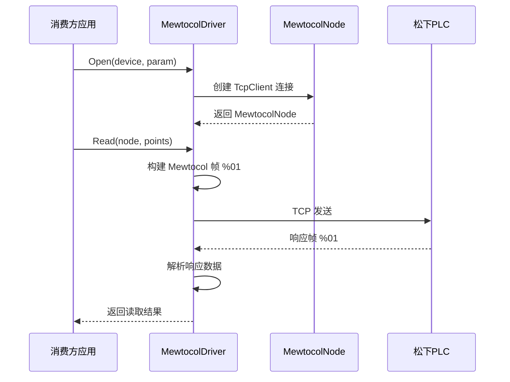

# NewLife.Panasonic 架构设计

> 版本：v1.1 | 日期：2026-07-22
> 需求对应：[需求文档](需求文档.md) | 功能清单：[功能清单](功能清单.md)

## 1. 整体架构

本项目为单一类库工程，基于 NewLife IoT 驱动模型实现松下 PLC 协议，支持三种通信方式。
整体架构如下：

### 设计原则

- **接口驱动**：基于 `NewLife.IoT` 定义的标准接口（`IDriver`、`INode`、`IDriverParameter`）实现，保证与 IoTEdge、ZeroIoT 等平台的即插即用。
- **继承复用**：基于 Modbus 的驱动继承 `ModbusDriver` 复用 Modbus 协议栈，仅需实现通道创建逻辑。
- **最小依赖**：尽量依赖 NewLife 生态基础包，新增协议时按需添加依赖。
- **场景覆盖**：同时支持 Modbus TCP、Modbus RTU 串口、Mewtocol 原生协议三种通信方式。

## 2. PLC — 松下PLC协议驱动

### 2.1 职责

| 职责 | 说明 |
|------|------|
| 松下 PLC 设备通信 | 通过 Modbus TCP / Modbus RTU / Mewtocol TCP 等协议与松下 PLC 通信 |
| 驱动注册发现 | 通过 `[Driver]` 特性实现驱动自动发现 |
| 连接参数管理 | 管理 TCP 地址、串口参数、站号、功能码、协议标识等连接参数 |

### 2.2 核心组件

| 组件 | 所在工程 | 说明 |
|------|----------|------|
| `PanasonicDriver` | `NewLife.Panasonic` | 统一驱动入口，继承 `ModbusDriver`，实现 `IDriver`。根据参数自动选择 Modbus TCP 或 Modbus RTU；内建心跳检测和自动重连（仅 TCP） |
| `PanasonicNode` | `NewLife.Panasonic` | Modbus 设备节点，实现 `INode`。承载 `Modbus`、`Host`、`ReadCode`、`WriteCode`、`Driver`、`Device`、`Parameter` 等运行状态 |
| `PanasonicParameter` | `NewLife.Panasonic` | 统一连接参数，继承 `ModbusParameter`。TCP：`Server`/`ProtocolId`；RTU：`PortName`/`Baudrate`/`DataBits`。驱动自动选择协议 |
| `MewtocolDriver` | `NewLife.Panasonic` | Mewtocol 原生协议驱动，实现 `IDriver`。直接通过 TCP 发送 Mewtocol 协议帧，支持 RCP/WCP/RCS/WCS 命令 |
| `MewtocolNode` | `NewLife.Panasonic` | Mewtocol 设备节点，实现 `INode`。承载 `TcpClient`、`NetworkStream` 等运行时连接状态 |
| `MewtocolParameter` | `NewLife.Panasonic` | Mewtocol 连接参数，实现 `IDriverParameter`。包含 `Server`、`Station`（站号）、`Block`（块号） |

### 2.3 关键流程

#### Modbus TCP 驱动初始化（含心跳检测）

#### Mewtocol TCP 读写流程

### 2.4 心跳检测与自动重连

`PanasonicDriver` 内建连接健康管理机制：

| 特性 | 说明 |
|------|------|
| 心跳间隔 | 可配置，默认 30 秒 |
| 检测方式 | 定期发送 Modbus 读保持寄存器请求（FC03）验证连接 |
| 自动重连 | 检测到连接断开后自动使用原参数重新建立连接 |
| 重试次数 | 可配置，默认最多 3 次 |
| 重试间隔 | 可配置，默认 1000ms |

## 3. 设计决策

| 决策 | 选项 | 选择 | 理由 |
|------|------|------|------|
| 主协议实现方式 | 纯Modbus TCP / 自定义松下协议 | Modbus TCP | 松下 PLC 支持 Modbus TCP 网关模式，复用 NewLife.Modbus 成熟协议栈，降低维护成本 |
| Mewtocol 协议策略 | 完整实现 / 最小可用 | 最小可用（TCP 基础读写） | Mewtocol 完整协议复杂，仅覆盖 RCP/WCP/RCS/WCS 命令，满足基本读写需求 |
| 串口支持方案 | 自定义串口驱动 / 复用 NewLife.ModbusRTU | 复用 NewLife.ModbusRTU | NewLife.ModbusRTU 已提供成熟 Modbus RTU/ASCII 实现，避免重复造轮子 |
| 驱动注册机制 | `[Driver]` 特性 / 手动注册 | `[Driver("PanasonicPLC")]` 等 | 遵循 NewLife.IoT 规范，支持 IoTEdge 和 ZeroIoT 自动发现驱动 |
| 参数模型 | 独立参数类 / 字典传参 | 独立类（PanasonicParameter 等） | 强类型参数，编译期类型安全，IDE 智能提示友好 |
| 目标框架 | 多框架 / 仅 netstandard2.1 | net45+net461+netstandard2.0+netstandard2.1 | 兼容老旧工业控制系统（多运行于 Windows 7/10 .NET Framework 环境） |
