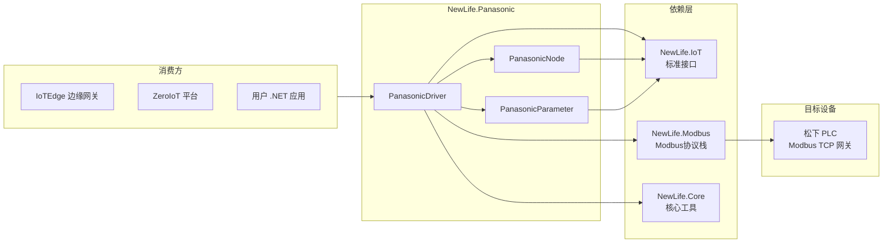
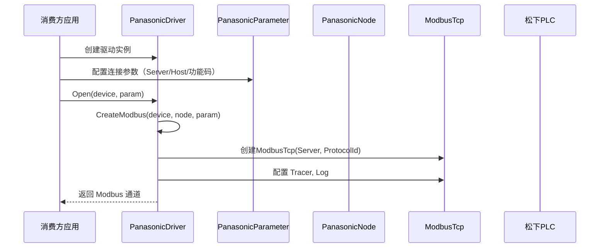
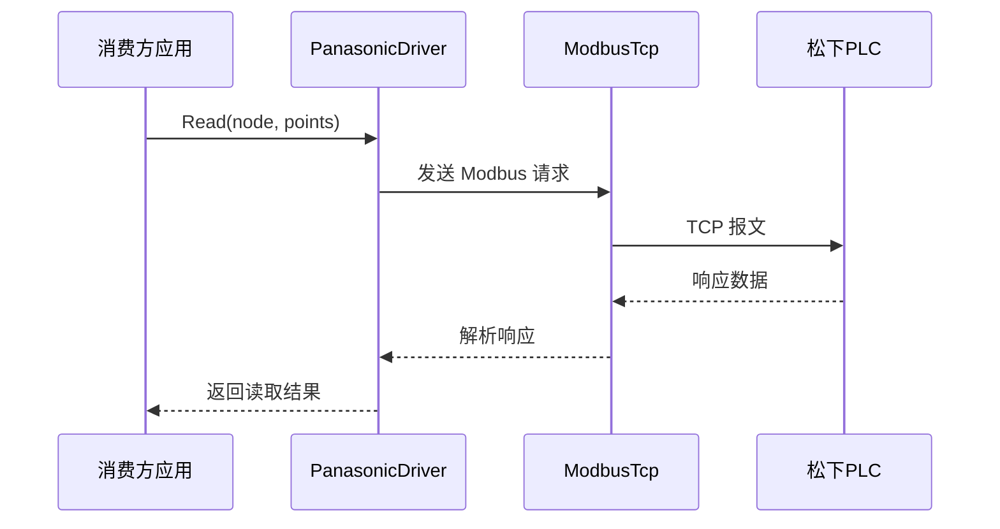

# NewLife.Panasonic 架构设计

> 版本：v1.0 | 日期：2026-07-22
> 需求对应：[需求文档](需求文档.md) | 功能清单：[功能清单](功能清单.md)

## 1. 整体架构

本项目为单一类库工程，基于 NewLife IoT 驱动模型实现松下 PLC 协议。整体架构如下：

### 设计原则

- **接口驱动**：基于 `NewLife.IoT` 定义的标准接口（`IDriver`、`INode`、`IDriverParameter`）实现，保证与 IoTEdge、ZeroIoT 等平台的即插即用。
- **继承复用**：继承 `ModbusDriver` 复用 Modbus TCP 协议栈，仅需实现协议相关的通道创建逻辑。
- **最小依赖**：仅依赖 `NewLife.Core`、`NewLife.IoT`、`NewLife.Modbus` 三个基础包。

## 2. PLC — 松下PLC协议驱动

### 2.1 职责

| 职责 | 说明 |
|------|------|
| 松下 PLC 设备通信 | 通过 Modbus TCP 协议与松下 PLC 网关通信 |
| 驱动注册发现 | 通过 `[Driver("PanasonicPLC")]` 特性实现驱动自动发现 |
| 连接参数管理 | 管理 TCP 地址、站号、功能码、协议标识等连接参数 |

### 2.2 核心组件

| 组件 | 所在工程 | 说明 |
|------|----------|------|
| `PanasonicDriver` | `NewLife.Panasonic` | 驱动入口，继承 `ModbusDriver`，实现 `IDriver`。负责创建 `ModbusTcp` 通道实例 |
| `PanasonicNode` | `NewLife.Panasonic` | 设备节点，实现 `INode`。承载 `Modbus`、`Host`、`ReadCode`、`WriteCode`、`Driver`、`Device`、`Parameter` 等运行状态 |
| `PanasonicParameter` | `NewLife.Panasonic` | 连接参数，实现 `IDriverParameter`。包含 `Server`（TCP 地址）、`ProtocolId`（协议标识）、`Host`（站号）、`ReadCode`/`WriteCode`（功能码） |

### 2.3 关键流程

#### 驱动初始化流程

#### 数据读写流程（由基类 ModbusDriver 处理）

## 3. 设计决策

| 决策 | 选项 | 选择 | 理由 |
|------|------|------|------|
| 协议实现方式 | 纯Modbus TCP / 自定义松下协议 | Modbus TCP | 松下 PLC 支持 Modbus TCP 网关模式，复用 NewLife.Modbus 成熟协议栈，降低维护成本 |
| 驱动注册机制 | `[Driver]` 特性 / 手动注册 | `[Driver("PanasonicPLC")]` | 遵循 NewLife.IoT 规范，支持 IoTEdge 和 ZeroIoT 自动发现驱动 |
| 参数模型 | 独立参数类 / 字典传参 | `PanasonicParameter` 独立类 | 强类型参数，编译期类型安全，IDE 智能提示友好 |
| 目标框架 | 多框架 / 仅 netstandard2.1 | net45+net461+netstandard2.0+netstandard2.1 | 兼容老旧工业控制系统（多运行于 Windows 7/10 .NET Framework 环境） |
